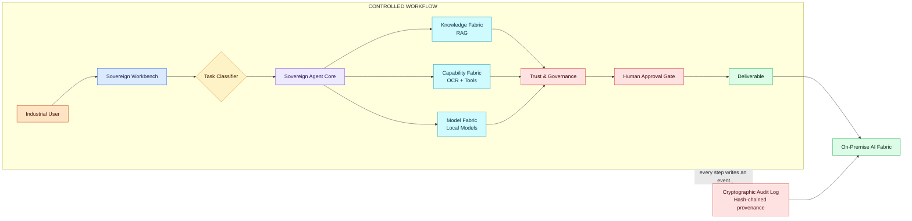

# <p align="center"></p>

# <p align="center">🔐 Sovereign Agentic Workbench 🔐</p>
### <p align="center">**Zero-Trust, Controlled Agentic AI Layer for Confidential Workflows**</p>

<p align="center">
  
  
  
  
  
  
</p>

---

## 🌟 Introduction

**Sovereign Agentic Workbench** is a zero-trust, controlled AI operating layer that orchestrates local models, organizational knowledge, and enterprise capabilities. Designed for confidential industrial, PSU, defense-linked, and government knowledge work, it ensures adaptive data protection, risk-based human governance, and cryptographic provenance while remaining strictly air-gapped.

The system features:
1.  **FastAPI & Streamlit Backend**: Orchestrates semantic query processing, agentic planning, and rigorous zero-trust policy enforcement.
2.  **React + Vite Dashboard**: A premium, responsive front-door interface for chatting, file management, projects, and deliverables.
3.  **Local AI Fabric**: Operates entirely on-premise using Ollama for local LLMs and ChromaDB for vector retrieval.

---

## ✨ Key Features

*   **🛡️ Zero-Trust Agent Governance**: Every action is governed by contextual policies. Adaptive data protection classifies information and chooses to allow, mask, tokenize, or restrict it based on context.

*   **🧠 Sovereign Agent Core**: Executes tasks using a ReAct-based framework (Plan → Execute → Observe → Verify → Iterate) using completely local models.

*   **🧩 Knowledge & Capability Fabrics**: Integrates deeply with SOPs, Manuals, and internal databases (RAG) alongside tools for OCR, Vision, Data Processing, and Code Execution.

*   **⚖️ Risk-Based Human Gate**: Autonomy is proportional to risk. Routine tasks auto-complete, while sensitive, high-risk work is stopped at a mandatory human approval gate.

*   **🔗 Cryptographic Provenance**: Maintains a tamper-evident workflow history (`H_N = Hash(Event_N + H_{N-1})`). Every output traces back to its exact data source and model version.

*   **🔒 100% Air-Gapped Egress**: All data, models, knowledge, tools, processing, and output remain on-premise.

---

## 📐 System Architecture

*Every request moves down this stack and every step it takes on the way is logged as a discrete, auditable event.*

<span style="color:#c2410c">#### `LAYER 0 · WHO'S ASKING`</span>
### Industrial User
Approval-desk officer, plant engineer, design office — bringing work that legally cannot leave the premises.
> `Scanned P&IDs` `Handwritten inspection notes` `Vendor correspondence` `Internal code / calc sheets`

<div align="center"><span style="color:#c2410c">↓</span></div>

<span style="color:#2563eb">#### `LAYER 1 · WHERE THEY WORK`</span>
### Sovereign Workbench
Chat and file/project workspace. Nothing more than an on-prem front door.
> `Chat` `Files` `Projects` `Tasks` `Deliverables`

<div align="center"><span style="color:#2563eb">↓</span></div>

<span style="color:#d97706">#### `LAYER 2 · THE ROUTING DECISION`</span>
### Task Classifier
Reads the request and its attachments, decides `task_type`, and picks which model handles it.
> `→ code` `→ document` `→ vision / scan` `→ spreadsheet`

<div align="center"><span style="color:#d97706">↓</span></div>

<span style="color:#7c3aed">#### `LAYER 3 · THE AGENT`</span>
### Sovereign Agent Core
*ReAct — Yao et al., 2022 (arXiv:2210.03629)*

Every step is a logged, auditable triple, not a black-box chain.
**`THOUGHT`** ➔ **`ACTION`** ➔ **`OBSERVATION`**
> *reasoning-only hallucinates · acting-only can't recover · the loop is why both are kept*

<div align="center"><span style="color:#7c3aed">↓</span></div>

<span style="color:#0891b2">#### `FABRICS`</span>

| 📘 Knowledge Fabric | 🛠️ Capability Fabric | 🧠 Model Fabric |
|:---|:---|:---|
| *RAG — Lewis et al., 2020*<br><br>• SOPs, manuals, past correspondence<br>• Dense retrieval, top-k passages<br>• **Provenance cited per output** | *Toolformer — Schick et al., 2023*<br><br>• OCR / vision connector<br>• Sandboxed code execution<br>• Office file writers<br>• *No-tool path is valid* | *LLaVA — Liu et al., 2023*<br><br>• General reasoner<br>• Code specialist<br>• Vision-projector LLM<br>• New open-weight models drop in |

<div align="center"><span style="color:#0891b2">↓</span></div>

<span style="color:#dc2626">#### `LAYER 4 · ALWAYS-ON`</span>
### Trust & Governance
Every Thought/Action/Observation triple is logged live. The network monitor is the sovereignty proof.
> `Full run log` `Live network monitor` `Access control` `Human sign-off gate`

<div align="center"><span style="color:#dc2626">↓</span></div>

<span style="color:#4338ca">#### `LAYER 5 · WHAT IT RUNS ON`</span>
### On-Premise AI Fabric
> `Mid-range GPU` `Local storage` `Runtime` `Vector DB` `Local model weights`

<br>

> 🔒 **AIR-GAPPED / NO CLOUD**
> All data, reasoning, and models stay inside the organization's own network — proven by the log, not stated on a slide.

### Architecture Flow



---

## 📂 Project Structure

```text
Sovereign-AI-Workbench/
├── sovereign_ai/             # Backend Application & AI Core
│   ├── app.py                # Streamlit Governance UI entry point
│   ├── main.py               # FastAPI backend entry point
│   ├── core/                 # Agent orchestration and ReAct loop
│   │   ├── agent.py          # SovereignAgent implementation
│   ├── document/             # File parsing and OCR
│   │   ├── parser.py         # PyMuPDF text extraction
│   │   └── ocr.py            # PyTesseract fallback vision
│   ├── rag/                  # Local knowledge base
│   │   └── vectorstore.py    # ChromaDB integration
│   ├── api/                  # API routes and models
│   ├── requirements.txt      # Python dependencies
│   └── .env.example          # Environment configuration
│
├── frontend/                 # Frontend Application (React 19 + Vite + Tailwind 4)
│   ├── src/                  # React components and App routing
│   │   ├── App.jsx           # Main Dashboard UI
│   │   ├── api.js            # Axios client
│   │   └── index.css         # Global styles
│   ├── package.json          # NPM scripts and dependencies
│   └── vite.config.js        # Vite bundler configuration
│
├── data/                     # Uploads, Vectors, and local storage (git-ignored)
└── README.md                 # Project documentation
```

---

## 🛠️ Tech Stack

*   **Backend & Agent Core**: Python, FastAPI, Streamlit
*   **AI Models**: Ollama (Open-weight reasoning, coding, vision), Sentence-Transformers
*   **Vector DB & Retrieval**: ChromaDB
*   **Document Processing**: PyMuPDF, PyTesseract, Pillow, python-docx
*   **Frontend**: React (v19), Vite, Tailwind CSS (v4), Lucide React

---

## 📊 Governance & Risk Matrix

Autonomy is dynamically determined based on the system's risk assessment engine.

| Risk Level | Example Task | System Behavior |
| :--- | :--- | :--- |
| **LOW** | Summarize a standard internal report. | Auto-complete & deliver. |
| **MEDIUM** | Compare a report against an SOP. | Execute & flag for review. |
| **HIGH** | Prepare an approval recommendation. | Hold for Human Approval. |
| **CRITICAL** | Safety-critical or financial authorization. | **Human approval mandatory.** |

---

## ⚙️ Configuration & Environment Variables

Create a `.env` file in the `sovereign_ai` directory:

```env
# Model Configuration
OLLAMA_BASE_URL=http://localhost:11434
DEFAULT_LLM_MODEL=llama3:8b-instruct
EMBEDDING_MODEL=all-MiniLM-L6-v2

# Storage and Directories
CHROMA_DB_PATH=./data/chromadb
UPLOAD_DIR=./data/uploads

# Governance Flags
STRICT_AIRGAP_MODE=true
REQUIRE_CRYPTOGRAPHIC_PROVENANCE=true
```

---

## 🏃 Setup & Execution

### 1. Backend Setup (Sovereign AI Core)

1.  Ensure you have [Ollama](https://ollama.com/) installed and running locally.
2.  Navigate to the backend directory and set up a Python virtual environment:
    ```bash
    cd sovereign_ai
    python -m venv .venv
    # Activate virtual environment
    # Windows:
    .\venv\Scripts\activate
    # macOS/Linux:
    source .venv/bin/activate
    ```
3.  Install required dependencies:
    ```bash
    pip install -r requirements.txt
    ```
4.  Run the FastAPI and Streamlit services:
    ```bash
    # Launch Streamlit Governance Interface
    streamlit run app.py

    # In a new terminal, launch FastAPI backend
    uvicorn main:app --reload --host 127.0.0.1 --port 8000
    ```

### 2. Frontend Setup (React + Vite)

1.  Navigate to the frontend folder and install dependencies:
    ```bash
    cd frontend
    npm install
    ```
2.  Run the Vite development server:
    ```bash
    npm run dev
    ```
3.  The main workbench UI will be accessible at `http://localhost:5173`.

---

## 🛡️ License

Distributed under the MIT License for internal distribution only.

---

<p align="center">Made with 🔐 by the Sovereign AI Team</p>