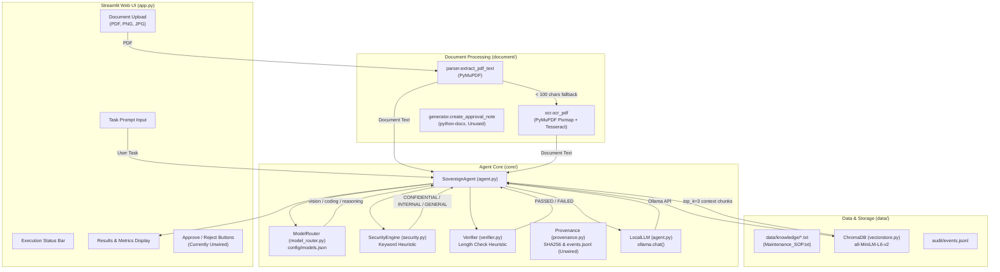

# Sovereign AI Workbench — Repository Audit & Architecture Assessment

**Audit Date**: September 2, 2026  
**Auditor**: Antigravity Assistant  
**Branch**: `tiYasa-development`  
**Phase**: Phase 0 — Comprehensive Repository Audit  
**Scope**: Zero modifications to existing runtime code. Pure architectural and codebase inspection.

---

## 1. Executive Summary

The **Sovereign AI Workbench** is designed as an on-premise, enterprise-grade AI operations platform operating with strict **zero external network egress**. It aims to deliver private, auditable, and governed agentic workflows for confidential enterprise data (such as industrial inspection reports, maintenance SOPs, and compliance records).

### Current State
The existing repository contains an **early proof-of-concept (PoC)** prototype. It demonstrates the conceptual pipeline:
1. File upload via Streamlit UI.
2. PDF text extraction with basic OCR fallback.
3. Keyword-based classification (`GENERAL`, `INTERNAL`, `CONFIDENTIAL`).
4. Rule-based model routing (`reasoning`, `vision`, `coding`).
5. Vector retrieval against a local ChromaDB instance using SentenceTransformers.
6. Local LLM prompting via the Ollama client.
7. Length-based output verification heuristic.
8. Unwired human-in-the-loop (HITL) approval buttons and a disconnected Word document generator.

While the foundational module layout exists, the current implementation consists largely of stubs, mock checks, hardcoded variables, and loose couplings that require systematic hardening before reaching production readiness.

---

## 2. Repository Structure

### Directory Tree

```
On-Premise-AI-workbench/
├── .git/
├── .gitignore
├── README.md                          # Minimal 1-line root readme
├── docs/
│   └── REPOSITORY_AUDIT.md            # [NEW] This document
└── sovereign-ai/
    ├── .env                           # Empty (0 bytes)
    ├── README.md                      # Empty (0 bytes)
    ├── requirements.txt               # 10 dependencies listed
    ├── app.py                         # Streamlit application entry point
    ├── setup_knowledge.py             # Knowledge ingestion script
    ├── audit/
    │   └── events.jsonl               # Contains corrupted sample data ("vjhv")
    ├── config/
    │   └── models.json                # Model router configuration
    ├── core/
    │   ├── __init__.py                # Empty
    │   ├── agent.py                   # LocalLLM and SovereignAgent orchestrator
    │   ├── model_router.py            # ModelRouter loading config/models.json
    │   ├── policy.py                  # Stub (contains print statement only)
    │   ├── provenance.py              # Provenance ledger (file hashing & JSONL logging)
    │   ├── security.py                # SecurityEngine keyword classifier
    │   └── verifier.py                # Verifier length-heuristic stub
    ├── data/
    │   ├── knowledge/
    │   │   └── Maintenance_SOP.txt    # Industrial SOP text file
    │   ├── uploads/                   # Created dynamically by app.py for uploads
    │   └── vector_db/                 # ChromaDB persistent store with indexed collection
    ├── document/
    │   ├── __init__.py                # Empty
    │   ├── generator.py               # create_approval_note (python-docx generator)
    │   ├── ocr.py                     # ocr_pdf using fitz + pytesseract
    │   └── parser.py                  # extract_pdf_text using fitz (PyMuPDF)
    ├── rag/
    │   ├── __init__.py                # Empty
    │   ├── ingest.py                  # Ingestion logic reading data/knowledge/*.txt
    │   ├── retriever.py               # Stub (contains print statement only)
    │   └── vectorstore.py             # LocalVectorStore (ChromaDB + all-MiniLM-L6-v2)
    └── utils/
        ├── __init__.py                # Empty
        └── hashing.py                 # Empty (0 bytes)
```

---

## 3. Architecture & Dataflow

### End-to-End Component Flow



---

## 4. Detailed Module & File Analysis

### 4.1 Root Directory
- **`README.md`**: Minimal title `# On-Premise-AI-workbench`. Lacks setup instructions, architecture docs, or requirements specification.
- **`.gitignore`**: Standard Python gitignore template ignoring `__pycache__`, virtual environments, `.env`, compiled libraries, and zip archives.

### 4.2 Application Entry Point (`sovereign-ai/app.py`)
- **Framework**: Streamlit (`st.set_page_config(layout="wide")`).
- **Sidebar**: Displays static, green/red status badges:
  - `LOCAL LLM` (hardcoded success)
  - `LOCAL RAG` (hardcoded success)
  - `POLICY ENGINE` (hardcoded success)
  - `AUDIT ACTIVE` (hardcoded success)
  - `EXTERNAL APIs BLOCKED` (hardcoded error/badge)
  *Finding*: These badges do not perform real connectivity, daemon, or network egress checks.
- **File Upload & Storage**: Saves files directly to relative path `data/uploads/` with the original filename.
- **Image Handling**: If a non-PDF file (PNG/JPG) is uploaded, it sets `document_text = "Image document uploaded. Vision processing required."`. No actual vision processing or OCR occurs for standalone image uploads.
- **Execution**: Instantiates `LocalVectorStore()` and `SovereignAgent(store)` on button click and calls `agent.run(task, document_text)`.
- **Governance Buttons**: Renders `✅ APPROVE & GENERATE DELIVERABLE` and `❌ REJECT` if `human_required == True`, but neither button has an event listener or callback attached.

### 4.3 Agent Core (`sovereign-ai/core/`)
- **`agent.py`**:
  - `LocalLLM`: Calls `ollama.chat(model=model, messages=[{"role": "user", "content": prompt}])`. Returns the raw string.
  - `SovereignAgent`: Coordinates classification, routing, RAG retrieval, LLM generation, and verification.
  - *Hardcoded values*:
    - Line 47: `task_type = "scanned_document"` is hardcoded for all runs, forcing `ModelRouter` to always select the vision model (`qwen3-vl:2b`).
    - Line 53: Filename is hardcoded as `"inspection_report.pdf"` during classification.
    - Line 35: `self.provenance = Provenance()` is initialized in `__init__`, but never called in `run()`. Audit events are never written to disk during agent execution.
- **`model_router.py`**:
  - Loads `config/models.json` via relative path `Path("config/models.json")`.
  - Maps `image`, `scanned_document`, `multimodal` $\rightarrow$ `models["vision"]` (`qwen3-vl:2b`).
  - Maps `coding`, `code_generation`, `code_review`, `debugging` $\rightarrow$ `models["coding"]` (`qwen2.5-coder:3b`).
  - Defaults to `models["reasoning"]` (`qwen3:4b`).
- **`security.py`**:
  - `SecurityEngine`: Scans text for 8 sensitive keywords: `["confidential", "internal", "inspection", "maintenance", "equipment", "vendor", "plant", "refinery"]`.
  - Count $\ge 2 \rightarrow$ `CONFIDENTIAL` (requires human review).
  - Count $= 1 \rightarrow$ `INTERNAL` (no human review).
  - Count $= 0 \rightarrow$ `GENERAL` (no human review).
  - Returns policy dictionary with boolean flags (`allow_local_processing`, `external_api`, `human_review`).
- **`verifier.py`**:
  - Prototype stub. Returns `supported = False` only if `len(answer.strip()) < 50`.
  - Evidence text is joined into a string but never evaluated against claims or citations.
- **`provenance.py`**:
  - Implements `hash_file(filepath)` returning SHA-256.
  - Implements `create_record(task, model, verification, approval, input_hash, output_hash)` appending JSON lines to `audit/events.jsonl`.
  - Currently uncalled and unintegrated with `agent.py` and `app.py`.
- **`policy.py`**:
  - One line: `print("policy.py loaded")`. Contains no executable policy logic.

### 4.4 Document Processing (`sovereign-ai/document/`)
- **`parser.py`**:
  - Uses PyMuPDF (`fitz.open()`) to extract text page-by-page. Returns list of `{"page": n, "text": "..."}`.
- **`ocr.py`**:
  - Renders PDF pages to 2x scale PNG pixmap with PyMuPDF, converts to PIL Image via `io.BytesIO`, and executes `pytesseract.image_to_string(image)`.
  - Requires external binary `tesseract.exe` to be present on the host system PATH.
- **`generator.py`**:
  - Implements `create_approval_note(findings, recommendation, output_path)` using `docx.Document()`.
  - Creates a styled Word document deliverable (`.docx`). Currently orphaned—not connected to the Streamlit UI approve action.

### 4.5 Retrieval-Augmented Generation (`sovereign-ai/rag/`)
- **`vectorstore.py`**:
  - Uses ChromaDB `PersistentClient(path="data/vector_db")`.
  - Collection name: `enterprise_knowledge`.
  - Embeddings: SentenceTransformers (`all-MiniLM-L6-v2`).
  - Ingestion flaw: Does not chunk text. Whole documents are converted into a single vector with generated IDs `doc_0`, `doc_1`. Re-ingesting will cause key collisions.
  - Search: Performs cosine/L2 vector search with `n_results=top_k` (default 3) and returns raw document texts without metadata or similarity distances.
- **`ingest.py`**:
  - Iterates over `data/knowledge/*.txt`, loads whole text, and pushes to `LocalVectorStore`.
- **`retriever.py`**:
  - One line: `print("retriever.py loaded")`. Unused stub.
- **`setup_knowledge.py`**:
  - Standalone script calling `ingest_knowledge()`.

### 4.6 Utilities & Audit (`sovereign-ai/utils/` & `sovereign-ai/audit/`)
- **`utils/hashing.py`**: Empty (0 bytes).
- **`audit/events.jsonl`**: Contains non-JSON corrupt sample string `"vjhv"`.

---

## 5. Environment, Dependencies & Runtimes

### 5.1 Python Environment
- **Host Python**: Python 3.14.4 (Windows 64-bit).
- **Virtual Environment**: No dedicated virtualenv (`.venv`) exists currently in the repository.

### 5.2 Dependency Audit (`sovereign-ai/requirements.txt`)

| Package in `requirements.txt` | Installed on Host | Import Status / Notes |
|---|---|---|
| `streamlit` | ❌ No | `ModuleNotFoundError` |
| `ollama` | ❌ No | `ModuleNotFoundError` |
| `chromadb` | ✅ Yes (v1.5.9) | Installed in global site-packages |
| `sentence-transformers` | ✅ Yes (v5.5.1) | Installed with PyTorch 2.12.0 |
| `pymupdf` (`fitz`) | ❌ No | `ModuleNotFoundError` |
| `pytesseract` | ❌ No | `ModuleNotFoundError` |
| `Pillow` (`PIL`) | ❌ No | `ModuleNotFoundError` |
| `python-docx` (`docx`) | ❌ No | `ModuleNotFoundError` |
| `pandas` | ❌ No | `ModuleNotFoundError` |
| `numpy` | ✅ Yes (v2.4.6) | Installed |

### 5.3 System Binaries & Daemons
- **Ollama**:
  - Binary `ollama.exe` is installed at `C:\Users\TIYASA KAMLE\AppData\Local\Programs\Ollama\ollama.exe`.
  - **Available Models in Ollama**: Only `mistral:latest` (4.4 GB).
  - **Configured Models in `models.json`**:
    - `qwen3:4b` (reasoning) — **Not present**
    - `qwen3-vl:2b` (vision) — **Not present**
    - `qwen2.5-coder:3b` (coding) — **Not present**
- **Tesseract-OCR**:
  - `tesseract.exe` is **not present** on the system PATH. Calls to `ocr_pdf` will raise a runtime failure (`TesseractNotFoundError`).

---

## 6. Existing Features vs. Roadmap Gaps

| Capability | Current State in Repository | Sovereign AI Roadmap Requirement |
|---|---|---|
| **API Layer** | None (only monolithic Streamlit script) | Robust FastAPI / REST endpoints with async processing, health checks, and task queue |
| **Frontend** | Basic Streamlit UI with hardcoded indicators | Modern, responsive UI with real-time streaming, HITL approval interface, document previewer, and audit dashboard |
| **Authentication & RBAC** | None (public access to UI) | Role-Based Access Control (Admin, Compliance Officer, Operator, Auditor) with local authentication/JWT |
| **Model Serving** | Direct synchronous `ollama.chat()` | Resilient local model client with streaming, model fallback, concurrency management, and health probing |
| **Model Routing** | Naive task-string matching in `model_router.py` | Dynamic intent classification, token budget awareness, capability matching, and graceful degradation |
| **RAG Pipeline** | Unchunked single-document ChromaDB store | Recursive chunking with overlap, semantic metadata tagging, hybrid BM25 + dense retrieval, cross-encoder reranking, and citation source attribution |
| **Document Processing** | PyMuPDF text extraction + Tesseract OCR stub | Multi-format parser (PDF, DOCX, XLSX, TXT, MD), robust OCR with layout retention, and vision model document analysis |
| **Deliverable Generation** | Static `docx` generator script (unwired) | Template-driven deliverable generator (DOCX, PDF, Markdown) tied directly to governance approval flow |
| **Provenance & Audit** | Unwired SHA-256 helper; corrupted log file | Immutable, tamper-evident audit ledger with cryptographically chained hashes, comprehensive event tracing, and export capabilities |
| **Security & Guardrails** | 8-keyword heuristic matching | Multi-tier security engine: prompt injection defenses, PII redaction, strict keyword & regex policies, and real network air-gap validation |
| **Verification / Guardrails** | Checks if answer length > 50 characters | Entailment / NLI-based grounding check, citation verification, factual hallucination scoring |
| **Testing** | 0 test files in repo | Comprehensive unit tests, integration tests, RAG evaluation metrics, and mock LLM test suites |

---

## 7. What Must Be Preserved

1. **Architectural Principles**:
   - Zero external egress: strictly on-premise computation without calls to commercial cloud APIs.
   - Controlled agentic reasoning: system prompts enforcing strict evidence attribution, separating observations from conclusions, and requiring human approval before action.
2. **Directory Separation**:
   - The logical partitioning of `core/`, `document/`, `rag/`, `config/`, and `audit/` is sound and should be maintained as the codebase matures.
3. **Core Domain Workflow**:
   - The industrial inspection and SOP compliance domain scenario (`Maintenance_SOP.txt` $\rightarrow$ inspection review $\rightarrow$ corrective maintenance approval note) represents a clear, tangible enterprise demonstration case.
4. **Technology Choices**:
   - Local ChromaDB with SentenceTransformers embeddings.
   - Local Ollama model execution.
   - Python-docx for enterprise document generation.

---

## 8. Risks & Architectural Concerns

1. **Path-Resolution Vulnerability**:
   All modules use relative paths (e.g., `Path("config/models.json")`, `Path("data/vector_db")`, `Path("audit/events.jsonl")`). When executed from the workspace root or via an external runner, execution fails because paths do not resolve relative to the module or project root.
2. **Missing Host Dependencies & Models**:
   - Attempting to run `app.py` currently crashes immediately due to missing Python packages (`streamlit`, `ollama`, `fitz`, etc.).
   - Executing the agent will crash if Ollama attempts to load `qwen3-vl:2b` or `qwen3:4b`, which are not pulled locally.
   - Executing OCR will crash if Tesseract is not installed on the host.
3. **False Sense of Governance**:
   - The Streamlit UI displays "AUDIT ACTIVE" and "EXTERNAL APIs BLOCKED", but no audit records are recorded during task runs and no network policies are enforced.
   - The `Verifier` passes any answer over 50 characters as "PASSED", risking ungrounded hallucinations passing as verified evidence.
4. **Vector Store Data Collision**:
   `LocalVectorStore.add_documents` creates fixed IDs `doc_0`, `doc_1`... If documents are re-ingested or added incrementally, ChromaDB will encounter ID collisions or overwrite existing documents.
5. **UI / Logic Coupling**:
   Business logic, vector store instantiation, and PDF processing are invoked directly inside Streamlit render blocks. A decoupled backend service layer is necessary for stability and testability.

---

## 9. Recommended Phased Implementation Roadmap

### Phase 1 — Environment, Working Directory Normalization & Test Harness
- Establish virtual environment requirements and dependency resolution.
- Normalize path resolution (convert relative paths to repository-root-relative or anchor using `Path(__file__).parent`).
- Set up `pytest` harness with mock LLM and vector store fixtures to enable test-driven verification across all subsequent phases.

### Phase 2 — Core Domain Models, Provenance & Audit System Hardening
- Repair and standardize `audit/events.jsonl` structure.
- Wire `Provenance` directly into `SovereignAgent.run()` so that every task, model selection, prompt hash, retrieval context hash, and output hash is permanently logged.
- Implement tamper-evident hashing chains for audit records.

### Phase 3 — Document Processing & Extraction Engine
- Unify document extraction into a robust `DocumentProcessor` handling PDFs, DOCX, and raw text.
- Standardize OCR fallback with clear error handling when system binaries are unavailable.
- Connect `create_approval_note` to the execution pipeline.

### Phase 4 — Production-Grade RAG Pipeline
- Implement recursive text chunking with overlap in `rag/ingest.py` rather than indexing whole files.
- Store chunk metadata (filename, page number, chunk index, SHA-256 hash).
- Implement robust retrieval in `rag/retriever.py` with similarity scoring and thresholding.

### Phase 5 — Model Orchestration, Routing & Verification Engine
- Update `config/models.json` to handle dynamically available models or fallbacks (e.g., fallback to available local `mistral:latest` if Qwen models are missing).
- Implement real verification: claim-evidence cross-checking and citation validation.
- Remove hardcoded task type and hardcoded filename assumptions in `agent.py`.

### Phase 6 — Security, Policy & Governance Engine
- Implement `core/policy.py` to enforce deterministic egress rules and document access restrictions.
- Expand `core/security.py` beyond basic keywords to support regex patterns, PII detection, and multi-tier sensitivity rules.
- Add user roles and simulated air-gap network boundary tests.

### Phase 7 — Application Layer & UI Enhancements
- Wire the Streamlit HITL approval buttons to trigger deliverable generation via `document/generator.py`.
- Provide real-time step streaming, inspection report view, audit ledger viewer, and deliverable download buttons.
- Connect status badges to real system probes (Ollama status, ChromaDB count, audit log status).

---

*Audit completed with zero code modifications to existing runtime files.*
